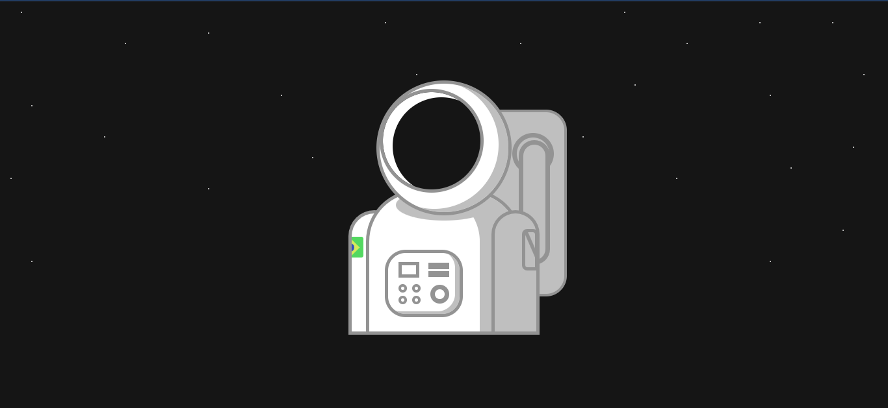

# Astronaut Css Art
<p align="center">

</p>

## Why? 🤔
To measure my habilities with pure css and based on my excitment on amazing draws made with this type of art, i've decided to do this art on my own.
Representing a astronaut that is a inspiring figure to all profissions, including programmers.

## Objectives/ Challenges 🎯
-   [x] Responsive
-   [x] Animated
-   [x] Using diferent techinques of alignment (position, flex, grid)

## Instalation 💻

To use it,choose a folder where it will be cloned or repository, open the / cmd terminal and use the * git * command below:
```
git clone https://github.com/JuanGustah/Astronaut-css-art.git
```
After that,open the index.html with the browser of your choice.
